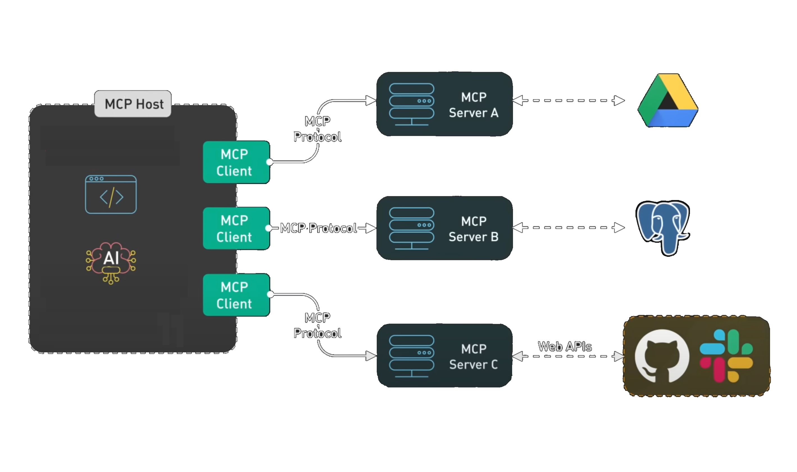

---

## *AI* Is a great tool to add to your Arsenal
- Helps you undertand new code bases
- Can genrate a lot of the boring stuff for you
- You can use multiple models to double check each other, and yourself
- With the Model Context Protocol (MCP) it can do a lot more

---

---

---

---

## What is MCP?
- MCP stands for Model Context Protocol
- Created by *Anthropic* in *November 2024*
- Facilitates communication between models and tools
- Standardizes tool automation and orchestration

---

---

## DEMO - Let's create our own

- Get a new project email from Gmail
- Create a proposal
- Convert it to PDF

---

## Some *Cool* MCP Servers
 - Sequential Thinking
    - Helps the Model plan
 - Memory
    - Knowledge graph based memory
    - Gives your *Model* the ability to remember
 - PostgreSQL Pro
    - Database Health Advice and Monitoring
    - Query Plans
    - Suggests Indexes
    - *Great with ORMs*   
---

## Some *Cool* MCP Servers cont...
- AWS MCP
    - Helps with AWS infrastructure design
    - Versions for:
        - CDK
        - TerraForm & CloudFormation
        - EKS and ECS Servers also available

- Grafana MCP
   - Managing Grafana
   - Queries, Dashboards, etc.
   - Context about bugs

---

## Resources

- AWS MCP Servers
    - https://awslabs.github.io/mcp/

- Sequential Thinking
    - https://github.com/modelcontextprotocol/servers/tree/main/src/sequentialthinking

- Memory
    - https://github.com/modelcontextprotocol/servers/tree/main/src/memory

- PostgreSQL Pro
    - https://github.com/crystaldba/postgres-mcp

---

## Resources Cont..    
- Grafana MCP
    - https://github.com/grafana/mcp-grafana

- FastMCP
    - https://github.com/jlowin/fastmcp

- Hugging Face MCP Course
    - http://huggingface.co/learn/mcp-course/en/unit0/introduction

---

## Contact Information

- Rachel Da Justa
- rachel@artitechs.dev
- https://artitechs.dev

---
## Thank You!
### This talk is available on *github*
https://github.com/racheldajusta/mcp_talk

